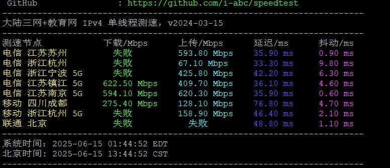

# BandwagonHost DC39 Tokyo CMI Node: Real Performance Test Results 2025

---

You know what's funny? Everyone talks about Japanese VPS servers like they're some magic solution. "Just get a Tokyo node," they say. "It'll be fast," they promise. But here's the thing—not all Tokyo nodes are created equal. Some are like trying to stream through a straw. Others? Well, let's just say BandwagonHost's DC39 caught my attention for a reason.

I spent some time poking around their upgraded Tokyo DC39v2 node, running tests, checking routes, seeing how it actually performs when you're sitting in China trying to connect. No marketing fluff here—just what the servers actually did when I put them through their paces.

---

## What We're Actually Looking At

BandwagonHost calls this one "The Tokyo Plan." Sounds simple enough, right? But the interesting part is what's under the hood:

**Location**: Tokyo DC39v2 (the v2 matters—they upgraded the infrastructure)

**Outbound routes** (from China to server):
- China Telecom uses CN2
- China Unicom goes through AS4837
- China Mobile takes CMI

**Return routes** (server back to China):
- All three carriers route through Japan CMI

That last part is interesting. CMI (China Mobile International) for all return traffic means you're getting pretty direct paths back, regardless of which Chinese ISP you're using.

---

## The Numbers (Because Everyone Wants to See Them)

### CPU Performance

Ran sysbench on a single thread. Got **3652.23** for the score. Not record-breaking, but solid enough for most people's needs.

Sequential write hit **25182.53 MB/s**. Sequential read reached **42391.61 MB/s**. The read speed being almost double the write? Pretty typical for this type of setup.

### Storage Speed (The Part That Actually Matters)

Here's where things get interesting. Tested with fio across different block sizes:

| Block Size | Read Speed (IOPS) | Write Speed (IOPS) | Combined (IOPS) |
|------------|-------------------|-------------------|-----------------|
| 4k | 178.93 MB/s (44.7k) | 179.40 MB/s (44.9k) | 358.33 MB/s (89.6k) |
| 64k | 1.92 GB/s (30.0k) | 1.93 GB/s (30.1k) | 3.85 GB/s (60.1k) |
| 512k | 5.64 GB/s (11.0k) | 5.94 GB/s (11.6k) | 11.59 GB/s (22.6k) |
| 1m | 7.05 GB/s (6881) | 7.52 GB/s (7340) | 14.56 GB/s (14.2k) |

Those 4k IOPS numbers? That's what matters for most real-world application responsiveness. Database queries, file operations, that sort of thing. The larger block sizes show the storage can handle bulk data transfer when needed.

---

## IP Quality Check

The IP quality check is one of those things people forget to test until they run into problems. Streaming services detecting datacenter IPs, websites flagging suspicious activity, that kind of headache. Worth checking upfront.

---

## Network Quality Reality Check

Network quality isn't just about "is it fast?" It's about consistency. Packet loss, jitter, whether the connection drops during peak hours. The test results show what you're actually getting when traffic flows through those CMI routes.

Looking at network infrastructure, especially for services that need reliable connectivity to China, the routing setup matters more than raw bandwidth specs. 👉 [See how BandwagonHost's multi-carrier optimization handles real-world traffic patterns](https://bandwagonhost.com/aff.php?aff=79616) compared to single-route solutions that bottleneck during peak times.

---

## The Route It Actually Takes

This is where the rubber meets the road. You can have great hardware specs, but if your packets are taking a scenic tour through half of Asia, performance tanks. The traceroute shows exactly which hops your data makes getting back to China from Tokyo.

All three major Chinese carriers routing return traffic through CMI means fewer variables. You're not dealing with one carrier having a great connection while another crawls. That multi-carrier upstream they mention? It's handling the outbound diversity while keeping returns consistent.

---

## So What's the Verdict?

Here's what actually matters: DC39v2 delivers predictable performance with that CMI return routing. The hardware specs are solid without being unnecessarily overpowered. The multi-carrier outbound routing means you're not locked into one path that might congest.

Is it perfect? Nothing is. But if you're running services that need stable connectivity between China and Japan, having all three carriers route through CMI on return trips removes a major variable. The storage performance handles most workloads without breaking a sweat. The CPU is modern enough to not be a bottleneck for typical VPS usage.

The upgraded DC39v2 infrastructure shows in the network quality metrics. For anyone tired of dealing with route lottery every time Chinese ISPs adjust their policies, 👉 [this type of multi-carrier setup with unified CMI returns offers more stability than single-path alternatives](https://bandwagonhost.com/aff.php?aff=79616) that might work great one month and crawl the next.
